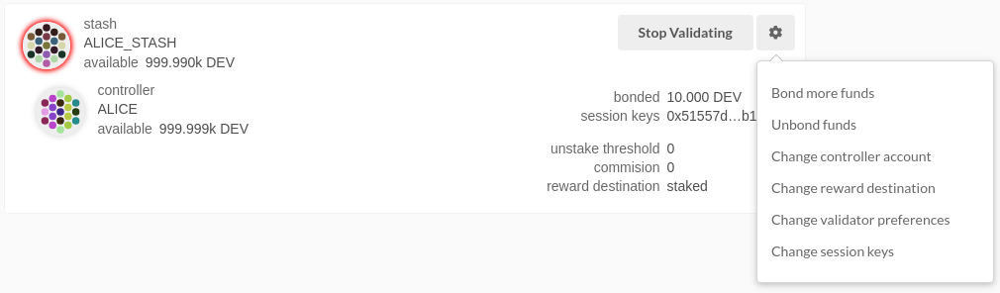
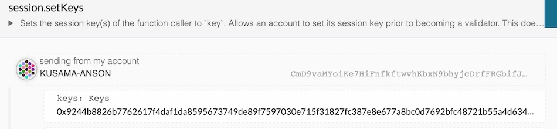

# 如何在 Kusama 设定验证人

**这教程将适用于 Kusama 网络**

在设置验证人之前，你很可能希望查看[安全验证人设置](./secure-validator-setup.md)页面，以确保你知道在设计验证人结构时应考虑哪些因素。

> 如果你有 KSM 但是没有足够技术知识设定验证人，最好也**不要**当验证人，任何 KSM 抵押到你的验证人都有可能被惩罚，意味着不安全或不正确的设置可能会导致损失 KSM！如果你没有信心有能力运行验证人节点，我们建议你把你的 KSM 提名到其它你信任的验证人身上。

如果你需要帮助，请到 [Kusama 论坛](https://forum.kusama.network/) 或 [Kusama 验证人频道](https://riot.im/app/#/room/#KusamaValidatorLounge:polkadot.builders)提问。

这个教程我们使用 Ubuntu 18.04，不论你使用那个操作系统，大部份设定也不会有太大区别。另外[这里](#vps)有些VPS服务器给大家选择。

## 安装 Rust

**注意:** 假如你经已安装了 Docker，你可以[使用Docker](#docker)，而不是在本地安装 Rust 并构建 Polkadot binary。

如果你没有安装 Rust，请先安装。以下指令将会下载并安装最新 Rust 版本。

```bash
curl https://sh.rustup.rs -sSf | sh
```

但是如果你经已安装 Rust，执行以下指令确保你是使用最本

```bash
rustup update
```
最后，运行以下指令以安装编译和运行 Kusama 节点所需的依赖项。

```
sudo apt install make clang pkg-config libssl-dev build-essential
```

注意 - 如果你是使用 OS X 和安装了 [Homebrew](https://brew.sh)，你可以使用以下指令而不是之前的命令：

```
brew install cmake pkg-config openssl git llvm
```

## 编译和安装 `Kusama` 节点

你需要在 `polkadot v0.5 branch` 代码中构建 `kusama` 

```bash
git clone https://github.com/paritytech/polkadot.git
# 更新节点，从这一步开始
cd polkadot
cargo clean
git checkout v0.5
git pull origin v0.5
./scripts/init.sh
cargo install --path ./ --force
```

注意: 如果你倾向使用 SSH 多过 HTTPS，你可以使用以下指令

`git clone git@github.com:paritytech/polkadot.git`.


此一步需要等一段时间（通常15-30分钟，具体取决于你的硬件)。

如果你有兴趣在本地生成密钥，你可以在同一个位置安装 `subkey`，之后可以把安装好可执行 `subkey` 转移到一台与世隔绝的电脑以增加额外安全。

```bash
cargo install --force --git https://github.com/paritytech/substrate subkey
```

## 同步链数据

当安装好所有相关依赖后，可以通过执行以下指令启动你的 Kusama 节点，开始同步链数据:

```bash
polkadot
```

同步数据可能需要几分钟到几个小时。

如果你想了解还需要多长时间，可以查看 `polkadot` 程序日志所显示的区块高度与 [Telemetry](https://telemetry.polkadot.io/#/Alexander) 或  [PolkadotJS Block Explorer](https://polkadot.js.org/apps/#/explorer) 所显示的区块高度比较一下。

> **注意:** 如果你没有 KSM，那你就需要等待非正式发布结束后才能继续下面的步骤。你仍然可以运行节点，但由于在非正式发布期间不能够發送 KSM，因此需要少量的 KSM 才能继续后面的步骤。 请留意，即使对于那些拥有 KSM 的人，他们现在也只能表明他们验证的 _意向_，在 NPoS 阶段开始之前，他们也无法运行验证人。

## 绑定 KSM

**注意:** 在非正式发布期间，Controller 和 Stash 也必须是同一帐号，除非你有二个帐号有 KSM。

现在可以开始设定验证人，首先我们将会做以下步骤：

- 绑定 `Stash` 帐号内的 KSM，这里的抵押将会是网络上的安全指标，并会随时因为做了些损害网络的行为被惩罚
- `Controller`，负责决定什么时候开始或停止运作验证

首先前往这里的 [Staking](https://polkadot.js.org/apps/#/staking/actions) 页面，选择 "Account Actions" 之后再按下 "New stake"。


- **Stash 帐号** - 选择你的 `stash` 帐号。在这个例子，我们绑定 39.456756 KSM，确保你 stash 帐号有最少这个数量，当然你可以抵押更多。
- **Controller 帐号** - 选择早前新增的 `controller` 帐号，这个帐号需要少量 KSM 使你能够启动和暂停验证。
- **Value bonded** - 你想从 `stash` 帐号绑定/抵押多少 KSM。留意你不用绑定这个帐号所有的 KSM。另外你也可以在之后绑定更多 KSM，但是如果你之后想提取任何数量的 KSM，也需要等待数星期 ( Kusama 网络需要 28 天)。
- **Payment destination** - 发送验证奖励的帐號。在[这里](https://wiki.polkadot.network/en/latest/polkadot/learn/staking/#reward-distribution)查看更多信息。

一旦所有内容都填写后，请按下`Bond` 并签署交易。

几秒钟后，你应该看到 "ExtrinsicSuccess" 消息。现在你应该看到一张包含所有帐号的新卡（注意:你可能需要刷新页面)。右边的绑定金额对应于 Stash 账户的资金。

## 设定 Session Key

当你的节点完全同步好后，利用 Control-C 把它停下来。在终端机，把你的节点启动验证人模式。

```bash
polkadot --validator --name "TELEMETRY_显示_名字"
```
> 注意: Kusama 经已上线! 当你启动 `polkadot` 时，它现在是你开始运行时的默认选项。

你可以为验证人提供你喜欢的名称，但请注意其他人将能够看到它，并且它将包含在使用相同 telemetry 服务器的所有服务器的列表中。 由于很多人正在使用 telemetry，因此建议你选择可能独特的名称。

你将通过 RPC 在客户端生成 [Session keys](https://wiki.polkadot.network/en/latest/polkadot/learn/keys/#session-key)。你可以通过连接到本地节点的Polkadot JS（Toolbox > RPC Calls> author > rotateKeys()) 来完成此操作。如果你这样做，请确保将Polkadot 浏览器连接到你的验证人(在 Settings 中)。


或者通过 CLI:

```bash
curl -H "Content-Type: application/json" -d '{"id":1, "jsonrpc":"2.0", "method": "author_rotateKeys", "params":[]}' http://localhost:9933
```

输出将会是有十六进制编码的 "result"。这是四个 Session Keys 的编码。

你需要通过签署和提交交易来把你的 Session Keys 告诉链。这是你的验证人与你的 Controller 帐号关联的原因。

前往 [Staking > Account Actions](https://polkadot.js.org/apps/#/staking/actions)，在你早前创建的绑定帐号点击 "Set Session Key"。之后输入从 `author_rotateKeys` 得回来的 Key 并且按 "Set Session Key"。




提交交易，你现在可以开始验证了。

## 抵押

查看你的节点是否运行中并已同步最新区块，请前往 [Telemetry](https://telemetry.polkadot.io/#list/Kusama%20CC1)。几秒钟后，将显示你的节点资料。请注意，这将显示 Kusama 网络上的所有节点，这就是名称的重要性！

如果没有问题，请在 Polkadot UI 点击 `Validate`。


- **Payment preferences** - 验证人会先取下这里设定的奖励，余下那些将会与提名你的人分享。

按下 `Validate`

如果你前往 Staking 页面，你应该会看到当前在网络上运行的所有验证人和所有表示有兴趣成为验证人的候选人。在页面最顶部也显示了验证人数量空缺和有多少候选人在竞选。


你的节点将显示在 *next up* 队列中。在[soft launch](#soft-launch)期间，era 没有变化，你的节点将保留在队列中，直到转换到 Proof-of-Stake 验证人竞选。

**在非正式发布后:** 每个 era 也会重新运行算法选出验证人。在下一个 era，如果有空缺位置并且你的节点成功获选，你的节点将会正式成为验证人。在那之前，你的节点仍将是在 _next up_ 队列。如果你的节点没有成为验证人，节点仍将显示在 *next up* 队列中。如果你在该 era 没有成为验证人，你不需要重新启动它。但是，为了成为验证人，你可能需要增加抵押 KSM 的数量或寻找提名人支持你的节点。

## 非正式发布

当 Kusama 启动时，它将成为一个权威证明(Proof-of-Authority) 网络，由 Web3 Foundation 运行节点。當具有足够的 _next up_ 队列（50-100 个验证人）之后，网络将升级到NPoS 并允许验证人根据其抵押竞选成为验证人。


**恭喜你!** 如果你有按照以上步骤操作，你经已设定好 Kusama 网络的验证人！若果你需要帮助，请前往 [Kusama 论坛](https://forum.kusama.network/) 或 [Kusama 验证人聊天室](https://riot.im/app/#/room/#KusamaValidatorLounge:polkadot.builders)。

## 常见问题

**Q:** 不能同步链数据 0 peers


**A:** 确保 libp2p 端口 `30333` 打开，需要一些时间发现网络上其他的 peers。

## VPS 服务器

* [OVH](https://www.ovh.com.au/)
* [Digital Ocean](https://www.digitalocean.com/)
* [Vultr](https://www.vultr.com/)
* [Linode](https://www.linode.com/)
* [Contabo](https://contabo.com/)
* [Scaleway](https://www.scaleway.com/)

## 使用 Docker

如果你安裝了 Docker，你可以使用它来启动验证人节点，而无需构建 binary。 简单使用一行指令执行:

```sh
$ docker run parity/polkadot:v0.5.1 --validator --name "TELEMETRY_显示_名字"
```