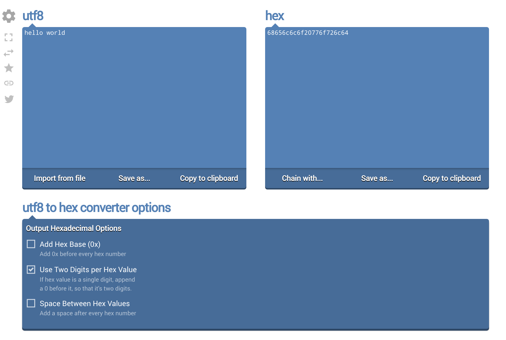
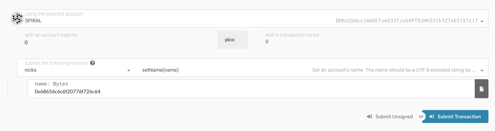

# Nicks

Nicks are simple on-chain nicknames that makes no attempt to create a name hierarchy, be a DNS replacement or provide
reverse lookups. They are not unique and no check is made if the nick already exists when it is registered.

## Setting a Nick

To register your account with a nick requires a small deposit. The name should be a utf-8 encoded string and can not
be shorter or longer by the module enforced bounds of 3 to 32 characters.

To convert a human readable name to the proper hex string, you can use an online converter like [this one](https://onlinehextools.com/convert-utf8-to-hex).

> For example, the human readable string "hello world" is converted to "0x68656c6c6f20776f726c64" in hex.

Next navigate to the [Polkadot Apps Dashboard](https://polkadot.js.org/apps) and go to the "Extrinsics" tab.

Select the account you would like to set the nick for and make sure you have enough KSM to cover the transaction fee
and small deposit (less than 0.1 KSM).

Select nicks -> setName(name) and in the `name` field enter the hex string from the converter.

Click "Submit Transaction" and you're done!

## Clearing a Nick

After setting a nick, you may want to clear it in the future if you want to go back to being a pseudonymous account and
get your deposit back.

This is easy to do from the same "Extrinsics" tab on the Polkadot Apps Dashboard.

Select the nicks -> clearName() option and click "Submit Transaction".

## Killing Nicks

Nicks can only be killed from `Root` or `Council` origins.
