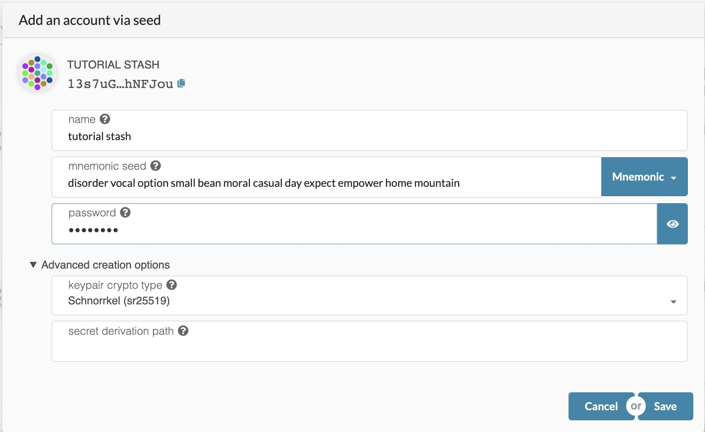
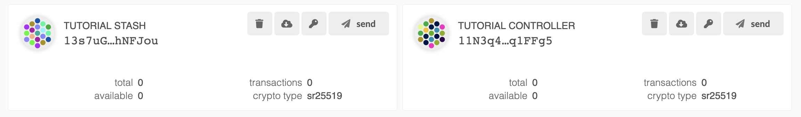
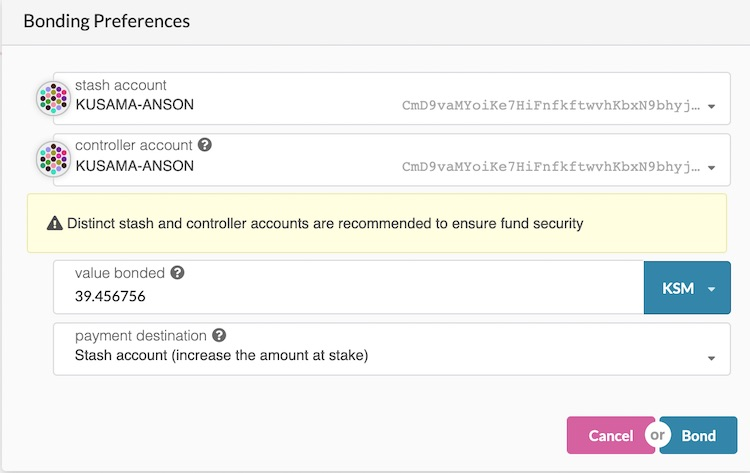
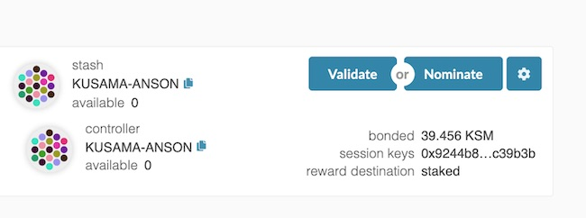
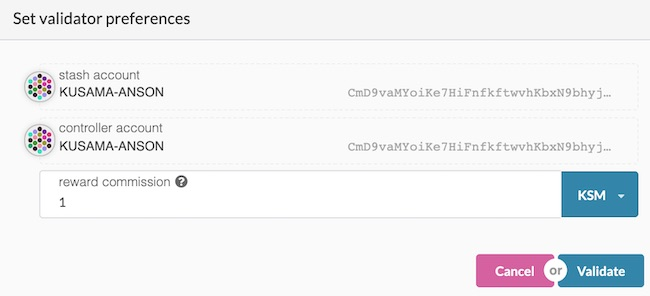
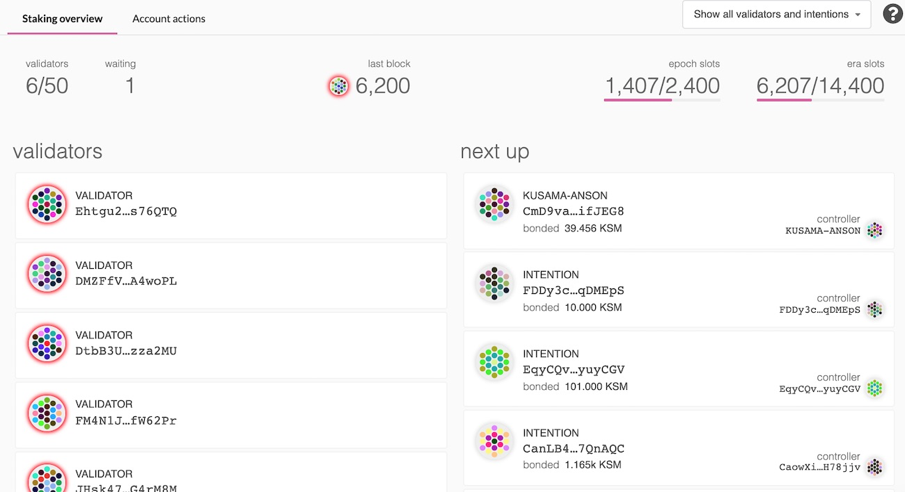

# How to validate on Kusama

**This guide works with Kusama network.**

Before setting up the validator, you will most likely want to take a look at the [Secure Validator Setup Page](./secure-validator-setup.md) to make sure you know what factors you should consider when designing your validator architecture.

You should **NOT** run a validator if you have KSM, but you do not have enough technical knowledge to set up a validator. Any KSM that you stake for your validator is liable to be slashed, meaning that an insecure or improper setup may result in loss of KSM tokens!  If you are not confident in your ability to run a validator node, it is recommended to nominate your KSM to a trusted validator node, instead.

If you need help, reach out on the [Kusama forum](https://forum.kusama.network/) or in the [Kusama Validator chat](https://riot.im/app/#/room/#KusamaValidatorLounge:polkadot.builders).

For this tutorial, we will use Ubuntu 18.04. No matter which operating system you are using, setup should be very similar. There are many [VPS](#vps-list) choices out there; feel free to pick the one you like.

## Install rust

If you have never installed Rust, you should do this first.  This command will fetch the latest version of Rust and install it.

```bash
curl https://sh.rustup.rs -sSf | sh
```

Otherwise, if you have already installed Rust, run the following command to make sure you are using the latest version.

```bash
rustup update
```

  Finally, run this command to install the necessary dependencies for compiling and running the Kusama node software.

```
sudo apt install make clang pkg-config libssl-dev build-essential
```

Note - if you are using OS X, if you have Homebrew ( https://brew.sh ) installed, you can issue the following equivalent command INSTEAD of the previous one:

```
brew install cmake pkg-config openssl git llvm
```

## Building and Installing Your `Kusama`  Node

You will need to build your `kusama` from the `polkadot` source code.

WARNING: The instructions below will currently build from the `master` branch of the repository.  The official Kusama build will be tagged, and this guide updated, before genesis.  You are welcome to try building now, but you will not get the official version of the validator software.  This means you may not be able to connect to the `Kusama` network or experience other (more serious and harder to debug) issues!

```bash
git clone https://github.com/paritytech/polkadot.git
# To update your node, run from this step.
cd polkadot
cargo clean
./scripts/init.sh
cargo install --path ./ --force
```

Note: If you prefer to use SSH rather than HTTPS, you can replace the first line of the above with `git clone git@github.com:paritytech/polkadot.git`.

This step will take a while (generally 15 - 30 minutes, depending on your hardware).

If you are interested in generating keys locally, you can also install `subkey` from the same directory.  You may then take the generated `subkey` executable and transfer it to an air-gapped machine for extra security.

```bash
cargo install --force --git https://github.com/paritytech/substrate subkey
```

## Synchronize chain data

After installing all related dependencies, you can start your Kusama node. Start to synchronize the chain by executing the following command:


```bash
polkadot --chain kusama
```

Depending on the size of the chain when you do this, this step may take anywhere from a few minutes to a few hours.

If you are interested in determining how much longer you have to go, your server logs (printed to STDOUT from the `polkadot` process) will tell you the latest block your node has processed and verified.  You can then compare that to the current highest block via [Telemetry](https://telemetry.polkadot.io/#/Alexander) or [PolkadotJS Block Explorer](https://polkadot.js.org/apps/#/explorer)

## Create accounts

In order to be a validator, you will need three separate accounts for managing your funds, namely `Stash`, `Controller` and `session`. If you want to know more about it, please see [here](https://wiki.polkadot.network/en/latest/polkadot/learn/staking/#accounts).


First, go to [PolkadotJS => Account](https://polkadot.js.org/apps/#/accounts) and click on the `add account` button.

To help you identify your accounts easily later on, we recommend you include `stash`, `controller` and `session` in the name your accounts (e.g., "JANE STASH", "JANE CONTROLLER", "JANE SESSION"). A mnemonic seed phrase is given to you for each of these accounts. You can save it in a safe place, offline, or you can choose to save your account using a JSON keyfile that will be generated automatically when clicking on `Save`. The password that is required to create an account will be used to sign any transaction made for each account. It will also be used to encrypt the JSON keyfile and will be required if you wish to restore your account using this file.

The mnemonic phrase for the `session` account needs to be used later in this guide to validate. Make sure you save it safely.
Another particularity you need to be aware of: both `stash` and `controller` account can use the `Schnorrkel (sr25519)` as keypair crypto type in the `Advanced creation options`, however, **you must use `Edwards (ed25519)` for the session account.**

On the following screen, choose *Create and backup account* to store your JSON key file on your computer. Together with your password, you can use this file to re-create your account.

Once all accounts have been created, the overview should show you something like this. Again, please note that the session account **must** use `ed25519`.



## Get token

To continue the following steps, you are required to get some KSM tokens for the `stash` and `controller` accounts in order to submit transactions and use these KSM as stake.

The `stash` and `controller` accounts should have at least 150 milliKSM to cover the existential deposit and transaction fees.  You can use the "send" functionality from the Accounts tab ( https://polkadot.js.org/apps/#/accounts ) of the Explorer to move the appropriate number of KSM to each account.  It is recommended to keep the majority of your KSM in the `stash` account, and only a small amount of KSM in the `controller` account for necessary actions.

The `session` account doesn't need any KSM in order to function.

You can take a look at the [claiming KSM user guide](https://kusamanetwork.github.io/KSM-dapp/) if you  participated in the DOT token sale in 2017.  You may also use the [Kusama Faucet](https://faucet.kusama.network) to obtain more KSM later.

## Bond KSM

It is now time to setup our validator. We will do the following:
- Bond the KSM of the `stash` account. These KSM will be put at stake for the security of the network and can be slashed.
- Select the `controller`. This is the account that will decide when to start or stop validating.
- Select the `session` account. This is the account whose seed will be used to run the node.

First, go to [Staking](https://polkadot.js.org/apps/#/staking/actions) section. Click on "Account Actions", and then the "New stake" button.




- **Stash account** - Select your `stash` account.  In this example, we will bond 100 milliKSMs - make sure that your stash account contains _at least_ this much.  You can, of course, stake more than this.
- **Controller account** - Select the `controller` account created earlier.  This account will also need a small amount of KSM in order to start and stop validating.
- **Value bonded** - How much KSM from the `stash` account you want to bond/stake. Note that you do not need to bond all of the KSM in that account.  Also note that tou can always bond _more_ KSM later.  However, _withdrawing_ any bonded amount requires the bonding duration period to be over (several months at the time of writing).
- **Payment destination** - The account where the rewards from validating are sent. More info [here](https://wiki.polkadot.network/en/latest/polkadot/learn/staking/#reward-distribution).

Once everything is filled in properly, click `Bond` and sign the transaction (with your `stash` account).

## Set the session key

After a few seconds, you should see an "ExtrinsicSuccess" message.  You should now see a new card with all your accounts (note: you may need to refresh the screen). The bonded amount on the right corresponds to the funds bonded by the `stash` account.


Click on `Set Session Key`.
Select the `session` account created previously and click on `Set Session Key`.

## Validate

You should now be able to see both `Validate` and `Nominate` buttons.

At this point and before validating, you should make sure your node is ready to validate.  If you are still running the `polkadot` command from earlier, you should stop it using Control-C.

At your terminal prompt, you will now run your validator with the mnemonic phrase from the `session` account, e.g:


```bash
polkadot --chain kusama --validator --key="SESSION_ACCOUNT_SEED_MNEMONIC" --name NAME_ON_TELEMETRY
```

Be sure to put the mnemonic phrase in double quotes ( `"`), otherwise the shell will not be able to parse it.

You can give your validator any name that you like, but note that others will be able to see it, and it will be included in the list of all servers using the same telemetry server.  Since numerous people are using telemetry, it is recommended that you choose something likely to be unique.

Make sure that the address generated from the seed corresponds to your `session` account's address.


To verify that your node is live and synchronized, head to [Telemetry](https://telemetry.polkadot.io/#/Kusama).  After a few seconds, your node information will be shown.  Note that this will show all nodes on the Kusama network, which is why it is important to select a unique name!

If everything looks good, go ahead and click on `Validate` in Polkadot UI.




- **Unstake threshold** - How often you want to be reported offline (and slashed) before being removed from the validator set.
- **Payment preferences** - Rewards you will keep, the rest will be shared among you and your nominators.

Click `Validate`

If you go to the Staking tab, you should see a list of active validators currently running on the network, as well as any nodes which have signaled their intention to be validators but have not yet been selected as being part of the current validator set. At the top of the page, it shows how many validators slots are available and how many nodes are intended to be a validator.



Your node will be shown in the *next up* queue. The validator set is refreshed every era (600 blocks, or approximately one hour). In the next era, if there is a slot available, and your node is selected to join the validator set, your node will become an active validator.  Until then, it will remain the _next up_ queue.  If your validator is not selected to become part of the validator set, it will remain in the _next up_ queue until it is.  There is no need to re-start if you are not selected for the validator set in a particular era.  However, it may be necessary to increase the number of DOTs staked or seek out nominators for your validator in order to join the validator set.

**Congratulations!**  If you have followed all of these steps, and been selected to be a part of the validator set, you are now running a Kusama validator! If you need help, reach out on the [Kusama forum](https://forum.kusama.network/) or in the [Kusama Validator chat](https://riot.im/app/#/room/#KusamaValidatorLounge:polkadot.builders).

## VPS List

* [OVH](https://www.ovh.com.au/)
* [Digital Ocean](https://www.digitalocean.com/)
* [Vultr](https://www.vultr.com/)
* [Linode](https://www.linode.com/)
* [Contabo](https://contabo.com/)
* [Scaleway](https://www.scaleway.com/)
